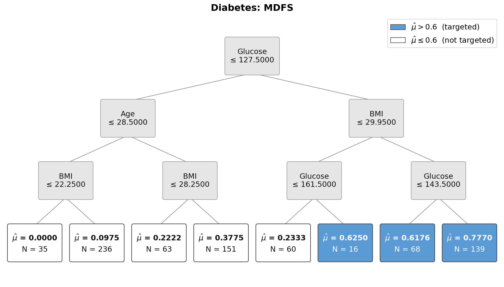
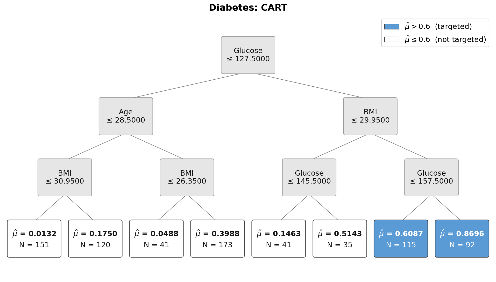
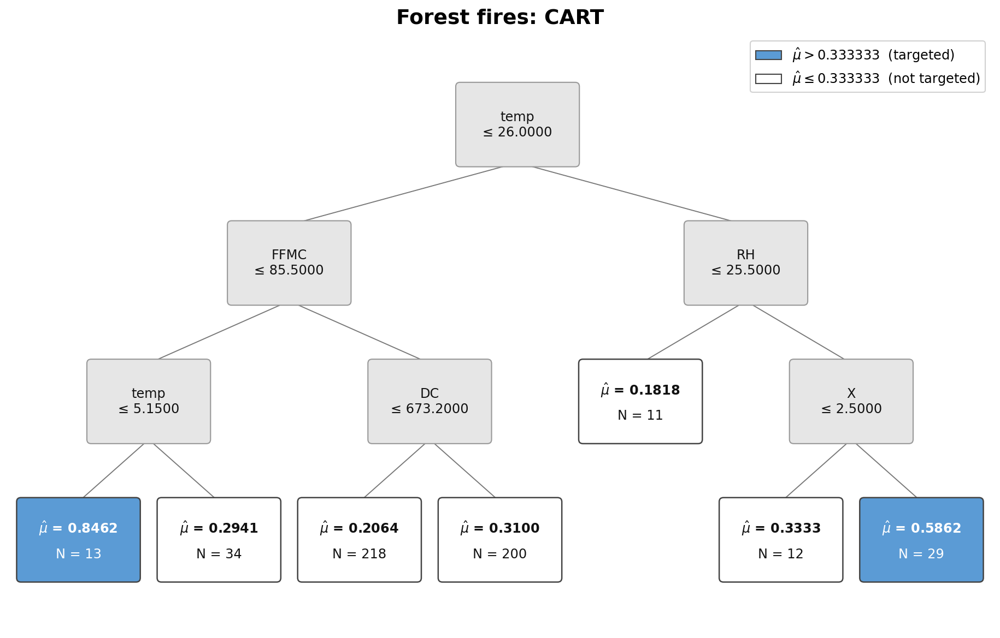
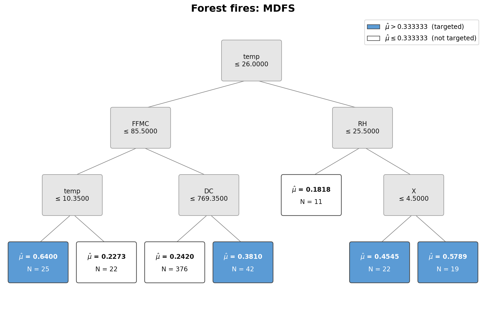
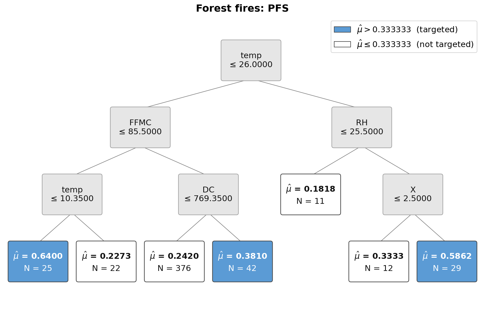
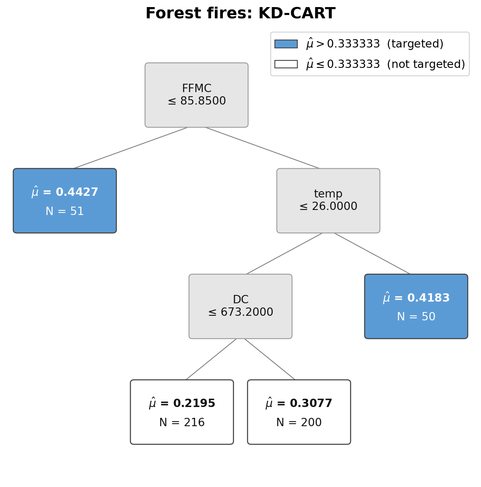
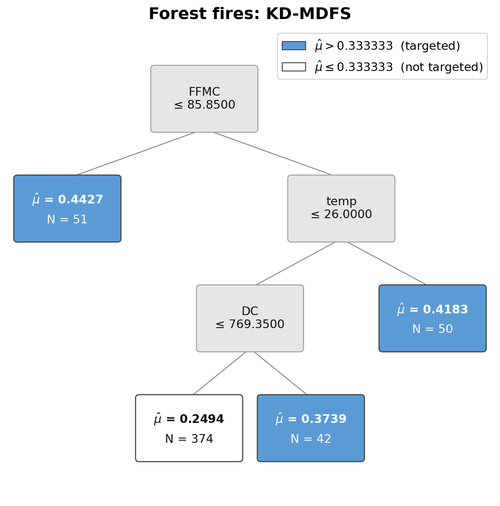

# targetree for Python

`targetree` helps applied researchers construct interpretable targeting rules
for binary outcomes. It fits classification trees using CART, Penalized Final
Split (PFS), or Maximum Distance Final Split (MDFS), evaluates the resulting
targeting policy, and draws publication-ready tree diagrams. It can also
distill predicted probabilities from a flexible teacher model into
interpretable KD-CART and KD-MDFS trees. The package requires Python 3.9 or
newer.

## Installation

Install the package directly from GitHub in a terminal:

```bash
python -m pip install "git+https://github.com/Bill-Wang-Metrics/targetree-python.git"
```

To update the package later:

```bash
python -m pip install --upgrade --force-reinstall "git+https://github.com/Bill-Wang-Metrics/targetree-python.git"
```

Then verify the installation in Python:

```python
from targetree import CART
```

## What targetree produces

`targetree` converts a fitted classification tree into an interpretable
targeting policy. Internal nodes display the splitting rules. Terminal nodes
report the estimated outcome probability, $\hat{\mu}$, and subgroup size, $N$.
Blue terminal nodes are targeted because their estimated probabilities exceed
the selected policy threshold; white terminal nodes are not targeted.



## Quick start

This complete example downloads the public diabetes data, fits an MDFS tree,
evaluates its targeting policy, displays the tree, and saves a PDF copy:

```python
import pandas as pd

from targetree import CART
from targetree.tree_vis import plot_cart_tree

DATA_URL = (
    "https://raw.githubusercontent.com/Bill-Wang-Metrics/"
    "targetree-python/main/examples/data/diabetes.csv"
)
diabetes = pd.read_csv(DATA_URL)

predictors = [column for column in diabetes.columns if column != "Outcome"]
X = diabetes[predictors].to_numpy(dtype=float)
y = diabetes["Outcome"].to_numpy(dtype=float)

model = CART(
    depth=3,
    minimum_portion=0.02,
    method="mdfs",
    cut=0.60,
    feature_name=predictors,
)
model.fit(X, y)

diabetes_risk = model.predict(X)
targeted = diabetes_risk > model.cut
print("TP, FN, FP, TN =", model.get_risk(X, y))
model.print_tree()

plot_cart_tree(
    model.tree,
    feature_name=model.feature_name,
    cut=model.cut,
    title="Diabetes: MDFS",
    split_rule_lines=2,
)
plot_cart_tree(
    model.tree,
    feature_name=model.feature_name,
    cut=model.cut,
    title="Diabetes: MDFS",
    split_rule_lines=2,
    title_font_size=18,
    save_path="diabetes-mdfs.pdf",
)
```

`model.predict()` returns the terminal-node probability assigned to every
observation. `model.get_risk()` reports true positives, false negatives, false
positives, and true negatives. `minimum_portion=0.02` requires every terminal
node to contain at least `ceil(0.02 * len(y))` observations from the estimation
sample.

## Methods

Use the same `CART` class for all three algorithms and select the algorithm
with the `method` argument:

| `method` | Default `lbd` | Description |
|---|---:|---|
| `"cart"` | 0 | Standard CART splitting; the targeting threshold is applied after fitting |
| `"pfs"` | 0 | A threshold-focused final split with a researcher-selected weight, `lbd` |
| `"mdfs"` | 1 | A fully threshold-focused final split |

For PFS, set `lbd` between 0 and 1. The examples below use `lbd=0.5`.

## Worked examples

### Diabetes

Copy and paste this complete block to reproduce the three diabetes diagrams
displayed below. The script creates a `figures` directory in the current
working directory and saves all diagrams as PNG files.

```python
from pathlib import Path

import matplotlib.pyplot as plt
import pandas as pd

from targetree import CART
from targetree.tree_vis import plot_cart_tree

DATA_URL = (
    "https://raw.githubusercontent.com/Bill-Wang-Metrics/"
    "targetree-python/main/examples/data/diabetes.csv"
)
diabetes = pd.read_csv(DATA_URL)
predictors = [column for column in diabetes.columns if column != "Outcome"]
X = diabetes[predictors].to_numpy(dtype=float)
y = diabetes["Outcome"].to_numpy(dtype=float)

output_dir = Path("figures")
output_dir.mkdir(exist_ok=True)

for method, lbd in (("cart", None), ("mdfs", None), ("pfs", 0.5)):
    model = CART(
        depth=3,
        minimum_portion=0.02,
        method=method,
        lbd=lbd,
        cut=0.60,
        feature_name=predictors,
    )
    model.fit(X, y)
    print(method.upper(), model.get_risk(X, y))

    figure, _ = plot_cart_tree(
        model.tree,
        feature_name=model.feature_name,
        cut=model.cut,
        title=f"Diabetes: {method.upper()}",
        split_rule_lines=2,
        title_font_size=18,
        save_path=output_dir / f"diabetes-{method}.png",
    )
    plt.close(figure)
```

Diabetes CART tree:



Diabetes MDFS tree:


Diabetes PFS tree (`lbd=0.5`):


### Forest fires

The forest-fire example defines the binary outcome as one when the burned area
exceeds five hectares. Copy and paste this block to reproduce its three
diagrams:

```python
from pathlib import Path

import matplotlib.pyplot as plt
import pandas as pd

from targetree import CART
from targetree.tree_vis import plot_cart_tree

DATA_URL = (
    "https://raw.githubusercontent.com/Bill-Wang-Metrics/"
    "targetree-python/main/examples/data/forestfires.csv"
)
forestfires = pd.read_csv(DATA_URL)
predictors = [
    "X", "Y", "FFMC", "DMC", "DC", "ISI", "temp", "RH", "wind", "rain"
]
X = forestfires[predictors].to_numpy(dtype=float)
y = (forestfires["area"] > 5).to_numpy(dtype=float)
cut = 1 / 3

output_dir = Path("figures")
output_dir.mkdir(exist_ok=True)

for method, lbd in (("cart", None), ("mdfs", None), ("pfs", 0.5)):
    model = CART(
        depth=3,
        minimum_portion=0.02,
        method=method,
        lbd=lbd,
        cut=cut,
        feature_name=predictors,
    )
    model.fit(X, y)
    print(method.upper(), model.get_risk(X, y))

    figure, _ = plot_cart_tree(
        model.tree,
        feature_name=model.feature_name,
        cut=model.cut,
        title=f"Forest fires: {method.upper()}",
        split_rule_lines=2,
        title_font_size=18,
        save_path=output_dir / f"forestfires-{method}.png",
    )
    plt.close(figure)
```

Forest-fire CART tree:



Forest-fire MDFS tree:



Forest-fire PFS tree (`lbd=0.5`):



The confusion-matrix counts reproduce the R and Stata implementations:

| Dataset | Method | TP | FN | FP | TN |
|---|---|---:|---:|---:|---:|
| Diabetes | CART | 150 | 118 | 57 | 443 |
| Diabetes | MDFS | 160 | 108 | 63 | 437 |
| Diabetes | PFS (`lbd=0.5`) | 160 | 108 | 63 | 437 |
| Forest fires | CART | 28 | 123 | 14 | 352 |
| Forest fires | MDFS | 53 | 98 | 55 | 311 |
| Forest fires | PFS (`lbd=0.5`) | 49 | 102 | 47 | 319 |

## Knowledge distillation

The Python interface also supports knowledge distillation. First fit a
flexible *teacher* model and obtain its predicted probabilities. Then supply
those probabilities through `prob` when fitting `targetree`. With
`method="cart"`, this produces KD-CART. With `method="mdfs"`, it produces
KD-MDFS.

In probability-assisted fitting, ordinary splits and terminal-node estimates
use the teacher probabilities. For KD-MDFS, the final MDFS split continues to
use the observed binary outcome and the policy threshold. The following
complete block reproduces the two forest-fire knowledge-distillation diagrams
displayed below:

```python
from pathlib import Path

import matplotlib.pyplot as plt
import pandas as pd
from sklearn.ensemble import RandomForestClassifier

from targetree import CART
from targetree.tree_vis import plot_cart_tree

DATA_URL = (
    "https://raw.githubusercontent.com/Bill-Wang-Metrics/"
    "targetree-python/main/examples/data/forestfires.csv"
)
forestfires = pd.read_csv(DATA_URL)
predictors = [
    "X", "Y", "FFMC", "DMC", "DC", "ISI", "temp", "RH", "wind", "rain"
]
X = forestfires[predictors].to_numpy(dtype=float)
y = (forestfires["area"] > 5).to_numpy(dtype=float)

# The random forest is the flexible teacher model.
teacher = RandomForestClassifier(n_estimators=100, random_state=6)
teacher.fit(X, y)
teacher_probability = teacher.predict_proba(X)[:, 1]

output_dir = Path("figures")
output_dir.mkdir(exist_ok=True)

for method in ("cart", "mdfs"):
    model = CART(
        depth=3,
        minimum_portion=30 / len(y),
        method=method,
        cut=1 / 3,
        feature_name=predictors,
    )
    model.fit(X, y, prob=teacher_probability)
    print(f"KD-{method.upper()}", model.get_risk(X, y))

    figure, _ = plot_cart_tree(
        model.tree,
        feature_name=model.feature_name,
        cut=model.cut,
        title=f"Forest fires: KD-{method.upper()}",
        split_rule_lines=2,
        title_font_size=18,
        save_path=output_dir / f"forestfires-kd-{method}.png",
    )
    plt.close(figure)
```

Forest-fire KD-CART tree:



Forest-fire KD-MDFS tree:



| Method | TP | FN | FP | TN |
|---|---:|---:|---:|---:|
| KD-CART | 44 | 107 | 57 | 309 |
| KD-MDFS | 60 | 91 | 83 | 283 |

The example above uses in-sample teacher probabilities to mirror the original
package notebook. For out-of-sample performance evaluation, estimate the
teacher probabilities on separate or cross-fitted data before fitting and
evaluating the distilled tree.

## Tree output

When `save_path` is omitted, `plot_cart_tree()` displays the diagram. When it
is supplied, the function saves the diagram instead. PNG, PDF, and SVG output
are supported; a path without an extension defaults to PDF.

`font_size=None` automatically chooses the largest uniform node and legend
font that fits every box. Supply a positive number to override it. Use
`split_rule_lines=1` for a one-line rule such as `Glucose ≤ 127.5`, or
`split_rule_lines=2` to place the feature and condition on separate lines.
Set `title_font_size` independently; its default is slightly larger than the
resolved node font.

```python
plot_cart_tree(
    model.tree,
    feature_name=model.feature_name,
    cut=model.cut,
    title="MDFS tree",
    font_size=15,
    split_rule_lines=2,
    title_font_size=18,
    save_path="tree.pdf",
)
```

## Categorical predictors

Pass the zero-based positions of categorical predictors to
`categorical_features`. Convert a mixed data frame to an object array before
fitting:

```python
predictors = ["numeric_score", "region"]
X = data[predictors].to_numpy(dtype=object)
y = data["outcome"].to_numpy(dtype=float)

model = CART(
    depth=3,
    minimum_portion=0.05,
    method="mdfs",
    cut=0.35,
    feature_name=predictors,
    categorical_features=[1],
)
model.fit(X, y)
```

## Honest estimation

```python
model.fit(X_build, y_build)
model.honest_approach(X_honest, y_honest)
honest_predictions = model.predict(X_test, honest=True)
```

## Getting help

Use Python's built-in help system:

```python
help(CART)
help(plot_cart_tree)
```

Questions and bug reports can be submitted through the repository's
[Issues page](https://github.com/Bill-Wang-Metrics/targetree-python/issues).
